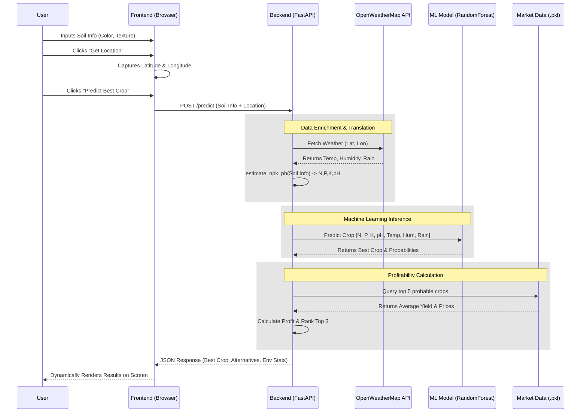

# Smart Agriculture Web Application: End-to-End Documentation

## 1. Executive Summary
The **Smart Agriculture Web Application** is an AI-powered system designed to assist farmers and agricultural planners in making data-driven decisions. Rather than relying on complex chemical soil testing inputs (which are often inaccessible to everyday farmers), this application uses heuristic mapping of visual soil characteristics paired with real-time geolocation weather data. It leverages a Machine Learning Random Forest algorithm to predict the most suitable crop for a specific plot of land and cross-references market data to recommend the most profitable alternatives.

## 2. System Architecture
The project follows a standard decoupled Client-Server architecture, but is served holistically through a single FastAPI instance for ease of deployment.

- **Client (Frontend)**: A single-page application built with Vanilla HTML/CSS/JS. It handles user input, captures browser geolocation, and renders AI predictions using modern Glassmorphism aesthetics.
- **Server (Backend)**: A Python FastAPI application that acts as the central brain. It receives frontend payloads, communicates with external weather APIs, handles the heuristic translation of soil data, and interfaces with the ML model.
- **Machine Learning Engine**: A pre-trained `RandomForestClassifier` encapsulated in a Scikit-Learn pipeline, serialized via `joblib`. 

## 3. Key Features
- **Heuristic Soil Translation**: Converts qualitative user inputs (Soil Color, Texture, Water Retention) into quantitative estimates for Nitrogen (N), Phosphorus (P), Potassium (K), and pH levels.
- **Live Environmental Data**: Integrates with the OpenWeatherMap API via browser-provided geolocation (Latitude/Longitude) to fetch live temperature and humidity, calculating estimated rainfall.
- **Precision Crop Prediction**: Predicts the optimal crop from 10 different categories using a 7-feature environmental matrix.
- **Profitability Engine**: Evaluates secondary crop recommendations against a synthetic market dataset (Yield × Market Price) to surface the Top 3 most profitable alternatives.

## 4. Technology Stack
- **Frontend**: HTML5, CSS3 (Vanilla), JavaScript (ES6+), Google Fonts (Outfit).
- **Backend Framework**: FastAPI (Python), Uvicorn (ASGI Server), Pydantic (Data Validation).
- **Machine Learning**: Scikit-Learn, Pandas, NumPy, Joblib.
- **External Integrations**: Browser Geolocation API, OpenWeatherMap API.

## 5. End-to-End Workflow (Data Flow)

1. **Input Phase**: The user selects physical soil characteristics from dropdown menus and clicks the geolocation button.
2. **Payload Construction**: The frontend compiles a JSON payload containing the soil heuristics and coordinates.
3. **Data Enrichment (Backend)**: 
   - The `/predict` endpoint receives the payload.
   - It fires an HTTP GET request to OpenWeatherMap using the coordinates to retrieve environmental data.
   - It runs the `estimate_npk_ph()` function to translate physical soil traits into numerical features.
4. **Inference Phase (ML)**: The 7 features (`[N, P, K, pH, Temp, Hum, Rain]`) are passed into the loaded `model.pkl`. The model's `predict()` function returns the best crop, while `predict_proba()` returns the probability distribution across all crops.
5. **Economic Ranking**: The backend takes the highest-probability alternative crops, queries `market_data.pkl` for their average yield and market price, calculates expected profit, and ranks the top 3.
6. **Response**: A JSON response containing the best crop, alternatives, and estimated environmental snapshot is sent back to the client and rendered dynamically.

## 6. Challenges Faced & Solutions

| Challenge | Impact | Implemented Solution |
| :--- | :--- | :--- |
| **Lack of Accessible Soil Data** | Users usually do not know their exact soil NPK or pH values, making standard ML models unusable for the average person. | **Heuristic Mapping Logic**: Developed a backend algorithm to translate visual/physical traits (e.g., "Black", "Sticky") into mathematically viable approximations for the ML model. |
| **Absence of Initial Dataset** | No historical dataset was provided for training the crop prediction model. | **Synthetic Data Generation**: Created a Python script (`train_model.py`) to procedurally generate 5,000 realistic data points based on known agricultural crop profiles and train the model dynamically. |
| **Geolocation Restrictions** | Browser geolocation often fails without HTTPS, or users may deny permission. | **Graceful Fallbacks**: Implemented frontend fallback coordinates (Center of India) and backend fallback weather values to ensure the application never breaks and always returns a prediction. |
| **CORS and Static Routing** | Separating frontend and backend often leads to Cross-Origin Resource Sharing (CORS) blocks during local development. | **Native Static Mounting**: Configured FastAPI to mount the `frontend/` directory natively, serving the HTML directly from the API domain, completely bypassing CORS issues. |

## 7. Future Enhancements
- **Dynamic Market Integrations**: Replace the static `market_data.pkl` with live commodities market APIs to fetch real-time crop pricing.
- **Historical Weather Analysis**: Instead of just using the current weather, use historical climate APIs to average the weather over a 3-month growing season.
- **Satellite Imagery**: Integrate with APIs like Sentinel Hub to analyze soil moisture and type from satellite images based purely on the user's coordinates.
